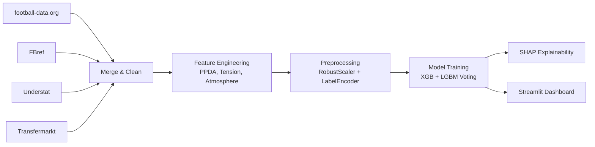

<div align="center">

# SmartClub 360
### Football Analytics & Contextual xG Modeling Platform

*Miuul Veri Bilimi Bootcamp – Bitirme Projesi*

[](https://www.python.org/)
[](https://streamlit.io/)
[](https://scikit-learn.org/)
[](LICENSE)

</div>

---

## İçindekiler

- [Proje Amacı](#proje-amacı)
- [Özellikler](#özellikler)
- [Klasör Yapısı](#klasör-yapısı)
- [Veri Pipeline](#veri-pipeline)
- [Kurulum](#kurulum)
- [Kullanım](#kullanım)
- [Model Bilgileri](#model-bilgileri)
- [Veri Kaynakları](#veri-kaynakları)
- [Yol Haritası](#yol-haritası)
- [Lisans](#lisans)

---

## Proje Amacı

**SmartClub 360**, endüstriyel futbol veri bilimi standartlarında geliştirilmiş, makine öğrenmesi destekli bir **"Piyasa Değeri İstihbaratı ve Oyuncu İzleme (Scouting)"** projesidir.

Klasik xG (Expected Goals) modellerinin ötesine geçerek, maçın **bağlamsal faktörlerini** (contextual factors) modele dahil eder:

- Maç **atmosferi** (Atmosphere Tension Index)
- Rakibin uyguladığı **ön alan baskısı** (PPDA – Passes Per Defensive Action)
- Genel **gerilim seviyesi** (Tension × PPDA etkileşimi)
- Maç dakikası, oyuncu pozisyonu, vücut bölgesi vb.

Bu yaklaşımla **yüksek baskı altında gerçek potansiyelini gösteren** değerli oyuncuları ucuza keşfedip (Moneyball stratejisi), takımlara stratejik scouting ve bütçe planlaması açısından veriye dayalı içgörüler sunmayı hedefler.

---

## Özellikler

- **End-to-end ML Pipeline:** Veri toplama → temizleme → feature engineering → modelleme → açıklanabilirlik.
- **Çoklu Veri Kaynağı Entegrasyonu:** football-data.org, FBref, Understat, Transfermarkt.
- **Ensemble Modelleme:** XGBoost + LightGBM `VotingClassifier` (soft voting).
- **Açıklanabilir AI:** SHAP ile feature importance ve şut bazlı açıklamalar.
- **Streamlit Arayüzü:** Futbol temalı, koyu yeşil saha hissiyle interaktif dashboard.
- **Bağlamsal xG:** Klasik xG'ye PPDA ve gerilim endeksleri eklenmiş özgün bir model.

---

## Klasör Yapısı

```
MiuulBitirmeProjesi/
├── app/                          # Streamlit arayüzü
│   ├── app.py                    # Ana uygulama
│   └── .streamlit/               # Tema/config
├── data/                         # Ham ve temizlenmiş veri setleri
│   ├── 2526_PL_Clean Data/       # Final temiz veri seti
│   │   └── PL_Model/             # Model pipeline scriptleri (0–4)
│   ├── fbref/                    # FBref verileri
│   ├── understat/                # Understat verileri
│   ├── transfermarkt/            # Transfermarkt piyasa değerleri
│   └── *.csv, *.json             # API ham çıktıları
├── models/                       # Eğitilmiş .pkl modelleri
│   └── xg_voting_clf.pkl         # Voting Classifier (XGB + LGBM)
├── notebooks/                    # EDA ve deneysel not defterleri
├── fetch_pl_data.py              # football-data.org maç verisi
├── fetch_pl_details.py           # football-data.org detaylı istatistik
├── fetch_fbref_data.py           # FBref scraping (soccerdata)
├── fetch_understat_data.py       # Understat scraping (soccerdata)
├── fetch_transfermarkt_data.py   # Transfermarkt scraping (SeleniumBase)
├── create_atmosphere_data.py     # Atmosfer/baskı özellik mühendisliği
├── create_presentation.py        # Otomatik sunum oluşturucu
├── requirements.txt
├── .env.example                  # Gizli anahtar şablonu
├── LICENSE                       # MIT
└── README.md
```

---

## Veri Pipeline



`data/2526_PL_Clean Data/PL_Model/` altındaki numaralı scriptler sırayla çalıştırılır:

| Adım | Script                          | Açıklama                                       |
| ---- | ------------------------------- | ---------------------------------------------- |
| 0    | `0_eda_analysis.py`             | Keşifçi veri analizi, görselleştirmeler        |
| 1    | `1_merge_and_prepare_data.py`   | Çoklu kaynak birleştirme                       |
| 2    | `2_data_preprocessing.py`       | Feature engineering, encoding, scaling         |
| 3    | `3_model_training.py`           | Cross-validation, GridSearch, Voting, SHAP     |
| 4    | `4_player_based_analysis.py`    | Oyuncu bazlı Contextual xG analizi             |

---

## Kurulum

### 1. Depoyu klonlayın

```bash
git clone https://github.com/huzeyfeozsoy/MiuulBitirmeProjesi.git
cd MiuulBitirmeProjesi
```

### 2. Sanal ortam oluşturun ve aktive edin

```bash
# Windows (PowerShell)
python -m venv .venv
.\.venv\Scripts\Activate.ps1

# macOS / Linux
python3 -m venv .venv
source .venv/bin/activate
```

### 3. Bağımlılıkları yükleyin

```bash
# Sadece uygulamayı çalıştırmak için:
pip install -r requirements.txt

# Veri çekme, model eğitimi ve tüm pipeline için:
pip install -r requirements-dev.txt
```

### 4. Ortam değişkenlerini ayarlayın

`.env.example` dosyasını `.env` olarak kopyalayın ve football-data.org API token'ınızı girin (ücretsiz token: <https://www.football-data.org/client/register>):

```bash
# Windows
Copy-Item .env.example .env

# macOS / Linux
cp .env.example .env
```

---

## Kullanım

### Streamlit dashboard'u çalıştırma

```bash
streamlit run app/app.py
```

Tarayıcıda `http://localhost:8501` açılır.

### Veri çekme (opsiyonel — temiz veriler zaten `data/` altında mevcut)

```bash
python fetch_pl_data.py              # PL maç verileri
python fetch_pl_details.py           # PL detaylı istatistikler
python fetch_fbref_data.py           # FBref (soccerdata)
python fetch_understat_data.py       # Understat
python fetch_transfermarkt_data.py   # Transfermarkt (headless Chrome)
python create_atmosphere_data.py     # Atmosfer endeksleri
```

### Modeli yeniden eğitme

```bash
cd "data/2526_PL_Clean Data/PL_Model"
python 0_eda_analysis.py
python 1_merge_and_prepare_data.py
python 2_data_preprocessing.py
python 3_model_training.py
python 4_player_based_analysis.py
```

---

## Model Bilgileri

| Özellik           | Değer                                                |
| ----------------- | ---------------------------------------------------- |
| Problem Tipi      | İkili sınıflandırma (`is_goal` 0/1)                  |
| Final Model       | `VotingClassifier(XGBoost + LightGBM, voting=soft)`  |
| Validasyon        | 5-fold Stratified Cross-Validation                   |
| Tuning            | `GridSearchCV` (learning_rate, max_depth, n_estimators) |
| Metrikler         | Accuracy, F1, ROC-AUC                                |
| Açıklanabilirlik  | SHAP TreeExplainer (LightGBM ağırlıklı)              |
| Scaler            | `RobustScaler` (yalnızca train fit, leakage yok)     |
| Çıktı Dosyası     | `models/xg_voting_clf.pkl`                           |

### Bağlamsal Özellikler (Highlights)

- `NEW_OPPONENT_PPDA` – Rakibin defansif aksiyon başına izin verdiği pas sayısı
- `Atmosphere_Tension_Index` – Maç bazlı atmosfer gerilim endeksi
- `NEW_TENSION_X_PPDA` – Etkileşim feature'ı (yüksek baskı × yüksek gerilim)
- `NEW_FOULS_PER_PPDA`, `NEW_IS_HIGH_TENSION`, `NEW_IS_LATE_GAME`

---

## Veri Kaynakları

| Kaynak                | Veri                                         | Erişim                |
| --------------------- | -------------------------------------------- | --------------------- |
| football-data.org     | Maç sonuçları, oyuncular, teknik direktörler | REST API (token)      |
| FBref                 | Maç bazlı takım/oyuncu istatistikleri        | `soccerdata.FBref`    |
| Understat             | Şut bazlı xG, takım maç istatistikleri       | `soccerdata.Understat`|
| Transfermarkt         | Oyuncu piyasa değerleri                      | SeleniumBase scraping |

> Veri sahipleri ve kullanım koşulları için ilgili sitelerin **ToS** belgelerini inceleyiniz. Bu repodaki veriler **yalnızca akademik/araştırma amaçlı** kullanılmıştır.

---

## Canlı Demo

Uygulama **Streamlit Community Cloud** üzerinde deploy edilmiştir:

> **[smartclub360.streamlit.app](https://smartclub360.streamlit.app)** *(deploy sonrası URL güncellenecektir)*

---

## Yol Haritası

- [ ] Hyperparameter Tuning'i `Optuna` ile değiştir
- [ ] Model versiyonlama için `MLflow` entegrasyonu
- [ ] Docker container'ı + Streamlit Cloud deployment
- [ ] Çoklu sezon / çoklu lig desteği
- [ ] REST API katmanı (FastAPI) ekleme
- [ ] CI/CD pipeline (GitHub Actions)

---

## Lisans

Bu proje [MIT Lisansı](LICENSE) altında dağıtılmaktadır.

---

<div align="center">

**Geliştirici:** [Huzeyfe Özsoy](https://github.com/huzeyfeozsoy)

*Miuul Veri Bilimi Bootcamp 2026 – Bitirme Projesi*

</div>
